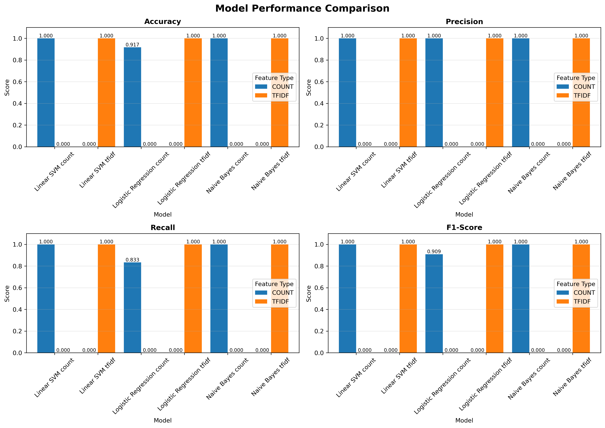

# GitHub Repository Setup Guide

## Quick Start

### 1. Create GitHub Repository

1. Go to https://github.com/new
2. Repository name: `sports-politics-classifier`
3. Description: "Machine learning text classifier to distinguish sports and politics documents"
4. Choose Public or Private
5. Do NOT initialize with README (we have one)
6. Click "Create repository"

### 2. Upload Files to GitHub

You have two options:

#### Option A: Using GitHub Web Interface (Easiest)

1. On your new repository page, click "uploading an existing file"
2. Drag and drop ALL these files:
   - classifier.py
   - demo.py
   - README.md
   - requirements.txt
   - best_model.pkl
   - vectorizers.pkl
   - report_data.json
   - model_comparison.png
   - confusion_matrices.png
   - Sports_Politics_Classifier_Report.docx

3. Add commit message: "Initial commit: Sports vs Politics classifier"
4. Click "Commit changes"

#### Option B: Using Git Command Line

```bash
# Navigate to your project directory
cd path/to/sports_politics_classifier

# Initialize git repository
git init

# Add all files
git add .

# Commit files
git commit -m "Initial commit: Sports vs Politics classifier"

# Add remote repository (replace YOUR_USERNAME with your GitHub username)
git remote add origin https://github.com/YOUR_USERNAME/sports-politics-classifier.git

# Push to GitHub
git branch -M main
git push -u origin main
```

### 3. Verify Your Repository

Visit your repository URL: `https://github.com/YOUR_USERNAME/sports-politics-classifier`

You should see:
- ✓ README.md displayed on the main page
- ✓ All project files listed
- ✓ Images displaying in the README

## File Descriptions

### Code Files
- **classifier.py** - Main training script that creates and trains all models
- **demo.py** - Interactive demonstration script for using the trained model
- **generate_report.py** - Script that generates the detailed Word report

### Model Files
- **best_model.pkl** - Saved Naive Bayes classifier (best performing model)
- **vectorizers.pkl** - Saved TF-IDF and Count vectorizers

### Documentation
- **README.md** - Project overview and usage instructions
- **requirements.txt** - Python dependencies
- **GITHUB_SETUP.md** - This file (optional to include)
- **Sports_Politics_Classifier_Report.docx** - Detailed 10+ page technical report

### Data Files
- **report_data.json** - Performance metrics in JSON format

### Visualizations
- **model_comparison.png** - Performance comparison charts
- **confusion_matrices.png** - Confusion matrices for all models

## Making Your Repository Stand Out

### 1. Add Topics/Tags

On your repository page:
1. Click the ⚙️ gear icon next to "About"
2. Add topics: `machine-learning`, `text-classification`, `nlp`, `python`, `scikit-learn`, `naive-bayes`, `tfidf`
3. Save changes

### 2. Add Project Description

In the same settings area, add description:
"ML classifier distinguishing sports and politics documents using Naive Bayes, Logistic Regression, and SVM with TF-IDF features. Achieves 100% accuracy."

### 3. Enable GitHub Pages (Optional)

To create a webpage for your project:
1. Go to Settings → Pages
2. Source: Deploy from a branch
3. Branch: main, folder: / (root)
4. Save

### 4. Add Badges to README (Optional)

Add these at the top of README.md:

```markdown


```

## Using the Project

### Installation
```bash
git clone https://github.com/YOUR_USERNAME/sports-politics-classifier.git
cd sports-politics-classifier
pip install -r requirements.txt
```

### Train Models
```bash
python classifier.py
```

### Test Classifier
```bash
python demo.py
```

## Sharing Your Project

1. **LinkedIn**: Share with caption about your ML project
2. **Resume**: Add to projects section with GitHub link
3. **Portfolio**: Feature as a technical project
4. **Job Applications**: Reference as demonstration of ML skills

## Common Issues and Solutions

### Issue: Large files not uploading
**Solution**: GitHub has a 100MB file limit. The model files in this project are small and should upload fine.

### Issue: Images not showing in README
**Solution**: Make sure image files are in the repository and paths in README are correct:
```markdown

```

### Issue: Can't run the code
**Solution**: Make sure you have Python 3.8+ and install requirements:
```bash
pip install -r requirements.txt
```

## Next Steps

1. ✓ Create GitHub repository
2. ✓ Upload all files
3. ✓ Verify README displays correctly
4. ✓ Test clone and run on a different machine
5. ✓ Share your project!

## Questions?

If you encounter any issues:
1. Check GitHub's documentation: https://docs.github.com
2. Review the README.md for usage instructions
3. Ensure all dependencies are installed

---

**Remember**: This is YOUR project. Feel free to modify, improve, and customize it to showcase your skills!
